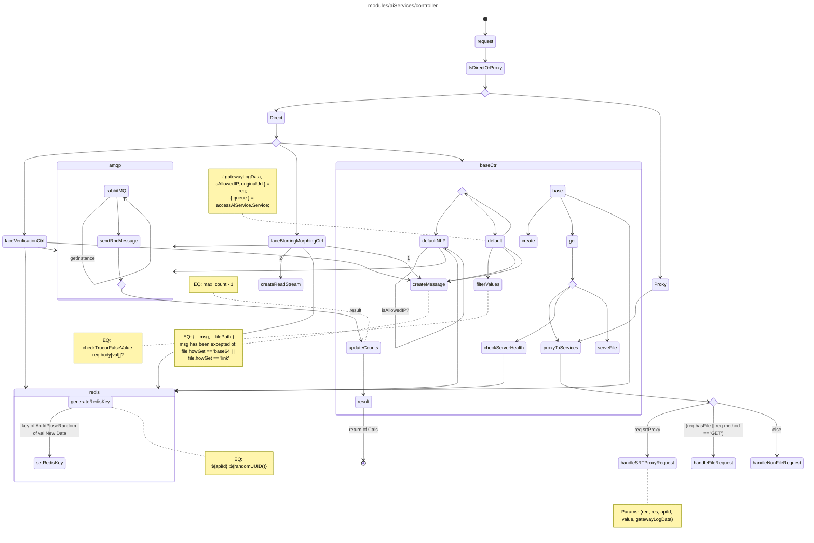

```mermaid
---
title: modules/aiServices/controller
---
stateDiagram            
state if_state <<choice>>
state if_state_nlp_ctrl <<choice>>
state if_state_ctrl <<choice>>
state if_state_rabbitMQ_result <<choice>>
state if_get <<choice>>
[*] --> request
request -->IsDirectOrProxy
IsDirectOrProxy --> if_state
if_state --> Direct    
    Direct -->  if_state_ctrl
    if_state_ctrl --> baseCtrl
    if_state_ctrl  --> faceVerificationCtrl       
    faceVerificationCtrl --> createMessage
    faceVerificationCtrl --> amqp
    faceVerificationCtrl --> redis
    if_state_ctrl  --> faceBlurringMorphingCtrl
    faceBlurringMorphingCtrl --> createMessage : 1
    faceBlurringMorphingCtrl --> createReadStream : 2
    faceBlurringMorphingCtrl --> amqp    
    faceBlurringMorphingCtrl --> redis    
    defaultNLP --> amqp            
    defaultNLP --> redis
    base --> redis   
    state baseCtrl {   
        base --> create
        base --> get             
        get --> if_get
        if_get --> proxyToServices
        if_get --> checkServerHealth        
        if_get --> serveFile
        default --> if_state_nlp_ctrl
        if_state_nlp_ctrl --> defaultNLP
        defaultNLP --> defaultNLP: isAllowedIP?                                             
        updateCounts --> result         
        note left of updateCounts            
                EQ: max_count - 1
        end note    
        if_state_nlp_ctrl --> default
            default --> filterValues            
            default --> createMessage
            note left of default            
                { gatewayLogData, isAllowedIP, originalUrl } = req;
                { queue } = accessAiService.Service;
            end note
            note right of filterValues
                EQ:  checkTrueorFalseValue req.body[val]]?
            end note
            default --> createMessage
            note right of createMessage
            EQ: { ...msg, ...filePath }
            msg has been excepted of: 
            file.howGet == 'base64' || file.howGet == 'link'
            end note
    }                 
if_state --> Proxy
    Proxy --> proxyToServices
    state if_req_srtProxy <<choice>>
    proxyToServices --> if_req_srtProxy
    if_req_srtProxy --> handleSRTProxyRequest: req.srtProxy    
    if_req_srtProxy --> handleFileRequest : (req.hasFile || req.method == 'GET') 
    if_req_srtProxy --> handleNonFileRequest: else
    note right of handleSRTProxyRequest
         Params: (req, res, apiId, value, gatewayLogData)
    end note
state amqp {   
rabbitMQ --> rabbitMQ: getInstance              
rabbitMQ --> sendRpcMessage
sendRpcMessage --> if_state_rabbitMQ_result
}
if_state_rabbitMQ_result --> updateCounts :result
checkServerHealth --> redis
state redis{
    generateRedisKey --> setRedisKey : key of ApiIdPluseRandom of val New Data
    note right of generateRedisKey            
               EQ: ${apiId}::${randomUUID()}
    end note
}
result --> [*] : return of Ctrls
```
