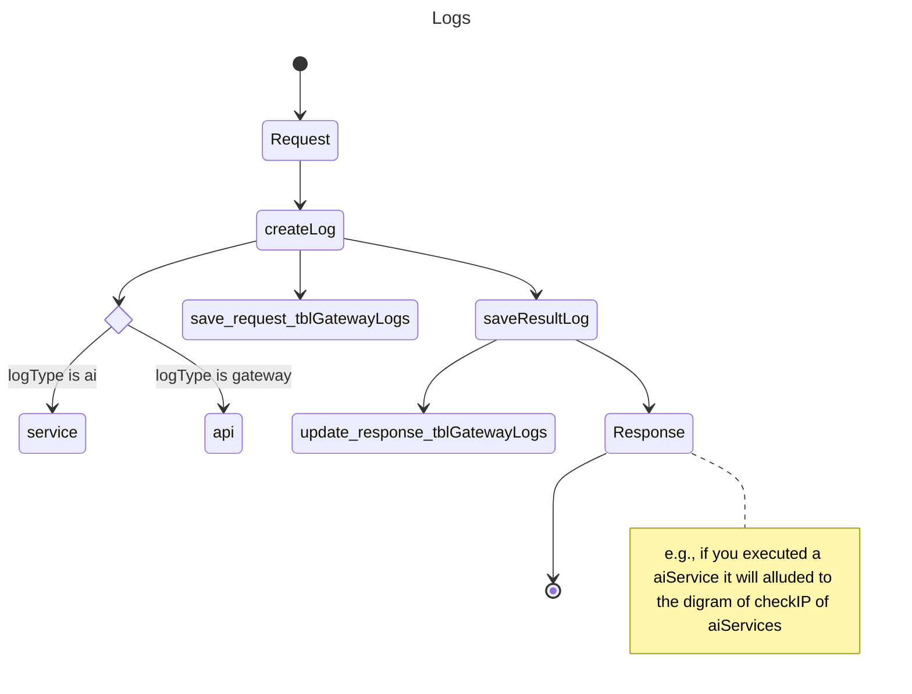

```mermaid
---
title: Logs
---
stateDiagram            
state if_Srv_Or_Api<<choice>>
[*] --> Request
Request --> createLog
createLog --> if_Srv_Or_Api
createLog --> save_request_tblGatewayLogs
if_Srv_Or_Api --> service  : logType is ai
if_Srv_Or_Api --> api  : logType is gateway
createLog --> saveResultLog
saveResultLog --> update_response_tblGatewayLogs
saveResultLog --> Response
Response --> [*] 
    note right of Response
               e.g., if you executed a aiService it will alluded to the digram of checkIP of aiServices
    end note
```