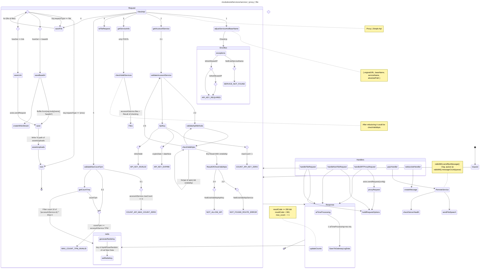

```mermaid
---
title: modules/aiServices/service | proxy | file
---
stateDiagram            
state if_IsNotAllowedIP <<choice>>
state if_NotExistApiKey <<choice>>
state if_NotExistServiceName <<choice>>
state if_NotExistValidApiService <<choice>>
state if_NotExistValidApiApiKey <<choice>>
state if_ApiKey_MaxCount <<choice>>
state if_ApiKey_ExpireDate <<choice>>
state if_ApiKey_IsValid <<choice>>
state if_ApiKey_IsValid <<choice>>
state if_ApiKey_IsValid <<choice>>
state if_Result_IsValid_APIs <<choice>>
state if_accessAiService_maxCount <<choice>>
state if_accessAiService_TPM <<choice>>
state if_saveFile <<choice>>
state if_base64 <<choice>>
state if_link <<choice>>

[*] --> request
request --> Request: HandleRequestOfFile
state ErrorBox { 
    exceptions --> if_IsNotAllowedIP: IsNotAllowedIP 
    if_IsNotAllowedIP --> API_KEY_REQUIRED 
    if_IsNotAllowedIP --> if_NotExistApiKey: IsNotAllowedIP 
    if_NotExistApiKey --> API_KEY_REQUIRED
    exceptions --> if_NotExistServiceName: NotExistServiceName 
    if_NotExistServiceName --> SERVICE_NOT_FOUND
}
state Handlers {
handleFileRequest 
handleNonFileRequest 
handleSRTProxyRequest 
grpcHandler
websocketHandler
}
Handlers --> Request
state Request {
    checkApi --> adjustServiceAndBaseName : 1 
    note right of checkApi            
                Proxy | Simple Api
    end note
    note right of adjustServiceAndBaseName            
              { originalURL, baseName, serviceName, absolutePath }
    end note
    adjustServiceAndBaseName --> ErrorBox: CheckUp
    checkApi --> getAccessAiService : 2 
    getAccessAiService --> validateAccessAiService : 2-1
    validateAccessAiService --> validateApiMethods : 2-2
    validateApiMethods --> checkValidApis    
    checkValidApis --> ResultOfCheckValidApis : EQ Result With isValidApi 
        if_NotExistValidApiService --> NOT_FOUND_ROUTE_ERROR : NotExistValidApiService
        ResultOfCheckValidApis --> if_NotExistValidApiService : 2-3
        if_NotExistValidApiApiKey --> NOT_ALLOW_API : NotExistValidApiApiKey
        ResultOfCheckValidApis --> if_NotExistValidApiApiKey : 2-4
    checkValidApis --> validateAccessAiService : 2-5
        validateAccessAiService --> ApiKey
        ApiKey --> if_ApiKey_MaxCount
        if_ApiKey_MaxCount --> COUNT_API_KEY_ZERO : maxCount< 1   
        ApiKey --> if_ApiKey_ExpireDate
        if_ApiKey_ExpireDate --> API_KEY_EXPIRE  : expireDate < dateNow
        ApiKey --> if_ApiKey_IsValid 
        if_ApiKey_IsValid --> API_KEY_INVALID : IsNotValid
        checkValidApis --> validateApiMethods
        checkValidApis --> checkValidApis : for(api of apis) && isValidApi
    checkApi --> getServiceInfo : 3
    getServiceInfo --> checkValidServices : only POSTs 
    checkValidServices --> Files: accessAiService.files = Result of checking
    note right of checkValidServices            
                After refactoring it could be checkValidApis
    end note
    checkApi --> isFileRequest : 4
    checkApi --> validateMaxCountTpm : 5
        validateMaxCountTpm --> if_accessAiService_maxCount: 5-1    
        validateMaxCountTpm --> if_accessAiService_TPM  : 5-2      
        if_accessAiService_maxCount --> COUNT_API_MAX_COUNT_ZERO : accessAiService.maxCount == 0    
        validateMaxCountTpm --> getCountTmp
        getCountTmp --> redis : Filter count 10 of '{accessAiService.id} *' Else 0
        getCountTmp --> if_accessAiService_TPM : countTpm
        if_accessAiService_TPM --> MAX_COUNT_TPM_INVALID : countTpm >= accessAiService.TPM        
    checkApi --> saveFile : 6     
        saveFile --> if_saveFile : for (file of files)
        if_saveFile --> next : req.requestType == 'proxy'
        next --> [*]
        if_saveFile --> saveFile : req.requestType == 'file'        
        if_saveFile --> if_base64 
        if_base64 --> saveBase64: howGet == base64
        if_saveFile --> if_link 
        if_link --> saveLink: howGet == link
        saveLink --> save : axios.sendRequest
        saveBase64 --> save  : Buffer.from(req.body[name], 'base64')      
        saveBase64 --> createWriteStream
        save --> assets/uploads : Write To path of assets/uploads 
        assets/uploads --> next
} 
handleSRTProxyRequest --> proxyRequest : axios.sendRequest(config)
handleSRTProxyRequest --> Response
handleNonFileRequest --> Response
handleFileRequest --> Response
proxyRequest --> buildRequestOptions
handleNonFileRequest --> buildRequestOptions
handleFileRequest --> buildRequestOptions
grpcHandler --> RemoteService
RemoteService --> sendFileSpeech
RemoteService --> checkServerHealth
note left of RemoteService            
        rabbitMQ.sendRpcMessage({ msg, queue }))
        rabbitMQ.messageCount(queue)
end note
websocketHandler --> createMessage
Request --> Response 
state Response {
aiTimeProcessing -->  SaveToGatewayLogData: 1 aiTimeProcessing=res-req
updateCounts
note left of updateCounts            
            resultCode >= 200 && resultCode < 300, max_count - = 1
end note
}
state redis{
    generateRedisKey --> setRedisKey : key of ApiIdPluseRandom of val New Data
}
Response --> redis
Response --> [*]
```
