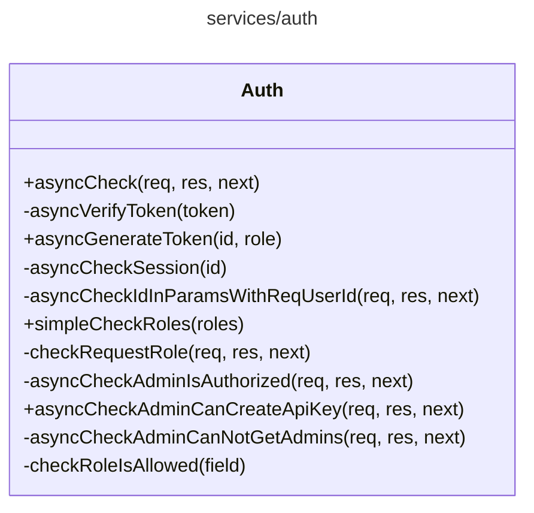

```mermaid
---
title: services/auth
---
classDiagram
    class Auth {
    +asyncCheck(req, res, next)
    -asyncVerifyToken(token)
    +asyncGenerateToken( id, role)
    -asyncCheckSession(id)
    -asyncCheckIdInParamsWithReqUserId(req, res, next)
    +simpleCheckRoles(roles)
    -checkRequestRole(req, res, next)
    -asyncCheckAdminIsAuthorized(req, res, next)
    +asyncCheckAdminCanCreateApiKey(req, res, next)
    -asyncCheckAdminCanNotGetAdmins(req, res, next)
    -checkRoleIsAllowed(field)
    }
```
