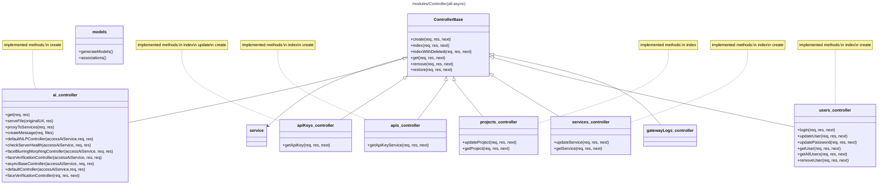

```mermaid
---
title: modules/Controller(all-async)
---
classDiagram
    ControllerBase --> service
    ControllerBase <|-- ai_controller
    ControllerBase <|-- apiKeys_controller
    ControllerBase <|-- apis_controller
    ControllerBase <|-- projects_controller
    ControllerBase <|-- services_controller
    ControllerBase <|-- users_controller
    ControllerBase <|-- gatewayLogs_controller
    ControllerBase: +create(req, res, next)
    ControllerBase: +index(req, res, next)
    ControllerBase: +indexWithDeleted(req, res, next)
    ControllerBase: +get(req, res, next)
    ControllerBase: +remove(req, res, next)
    ControllerBase: +restore(req, res, next)
    class models{
        +generateModels()
        +associations()
    }
    note for ai_controller "implemented methods:\n create"
    class ai_controller{
        +get(req, res)  
        +serveFile(originalUrl, res)
        +proxyToServices(req, res)  
        +createMessage( req, files)
        +defaultNLPController(accessAiService,req, res)
        +checkServerHealth(accessAiService, req, res)
        +faceBlurringMorphingController(accessAiService, req, res)
        +faceVerificationController(accessAiService, res, req)
        +asyncBaseController( accessAiService, req, res ) 
        +defaultController(accessAiService,req, res) 
        +faceVerificationController(req, res, next)
    }
    class gatewayLogs_controller{
    }
    note for apiKeys_controller "implemented methods:\n index\n update\n create"
    class apiKeys_controller{
        +getApiKey(req, res, next)
    }
    note for apis_controller "implemented methods:\n index\n create"
    class apis_controller{
        +getApiKeyService(req, res, next)
    }
    note for projects_controller "implemented methods:\n index"
    class projects_controller{
        +updateProject(req, res, next)
        +getProject(req, res, next)
    }
    note for services_controller "implemented methods:\n index\n create"
    class services_controller{
        +updateService(req, res, next)
        +getService(req, res, next)
    }
    note for users_controller "implemented methods:\n index\n create"
    class users_controller{
        +login(req, res, next)
        +updateUser(req, res, next)
        +updatePassword(req, res, next)
        +getUser(req, res, next)
        +getAllUsers(req, res, next)
        +removeUser(req, res, next)
    }
```