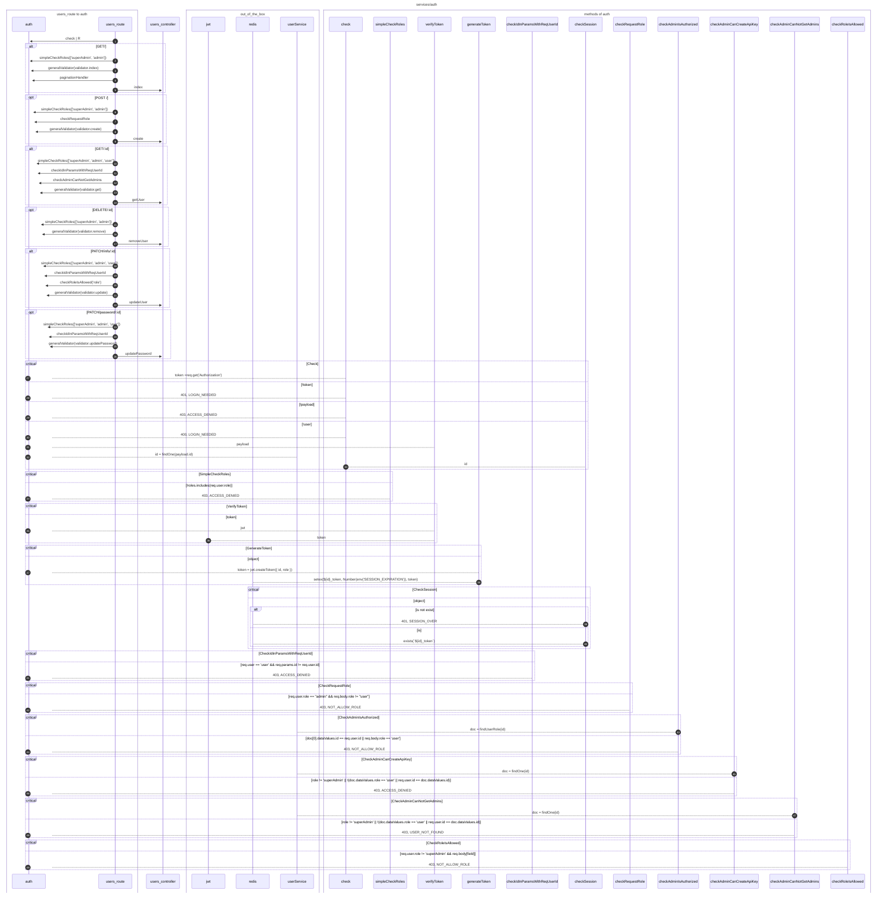

```mermaid
---
title: services/auth
config:
    sequence:
        showSequenceNumbers : true
---
    sequenceDiagram
    autonumber
    box users_route to auth
    participant auth
    participant users_route
    end    
    users_route ->> +auth: check | R       

    alt GET/    
    users_route ->> +auth: simpleCheckRoles(['superAdmin', 'admin'])
    users_route ->> +auth: generalValidator(validator.index)
    users_route ->> +auth: paginationHandler
    users_route ->> +users_controller: index
    end
    opt POST /
    users_route ->> +auth: simpleCheckRoles(['superAdmin', 'admin'])
    users_route ->> +auth: checkRequestRole
    users_route ->> +auth: generalValidator(validator.create)  
    users_route ->> +users_controller: create
    end    

    alt GET/:id
    users_route ->> +auth: simpleCheckRoles(['superAdmin', 'admin', 'user'])
    users_route ->> +auth: checkIdInParamsWithReqUserId
    users_route ->> +auth: checkAdminCanNotGetAdmins
    users_route ->> +auth: generalValidator(validator.get)
    users_route ->> +users_controller: getUser
    end
    opt DELETE/:id
    users_route ->> +auth: simpleCheckRoles(['superAdmin', 'admin'])    
    users_route ->> +auth: generalValidator(validator.remove)  
    users_route ->> +users_controller: removeUser
    end    

    alt PATCH/info/:id
    users_route ->> +auth: simpleCheckRoles(['superAdmin', 'admin', 'user'])
    users_route ->> +auth: checkIdInParamsWithReqUserId
    users_route ->> +auth: checkRoleIsAllowed('role')
    users_route ->> +auth: generalValidator(validator.update)
    users_route ->> +users_controller: updateUser
    end
    opt PATCH/password/:id
    users_route ->> +auth: simpleCheckRoles(['superAdmin', 'admin', 'user'])
    users_route ->> +auth: checkIdInParamsWithReqUserId
    users_route ->> +auth: generalValidator(validator.updatePassword)  
    users_route ->> +users_controller: updatePassword
    end    

    box out_of_the_box
    participant jwt
    participant redis
    participant userService
    end    

    box methods of auth
    participant check
    participant simpleCheckRoles
    participant verifyToken
    participant generateToken
    participant checkIdInParamsWithReqUserId    
    participant checkSession
    participant checkRequestRole
    participant checkAdminIsAuthorized    
    participant checkAdminCanCreateApiKey
    participant checkAdminCanNotGetAdmins
    participant checkRoleIsAllowed
    end    
    critical Check 
        auth-->check:  token =req.get('Authorization')
    option !token
        auth-->check: 401, LOGIN_NEEDED
    option !payload
        auth-->check: 403, ACCESS_DENIED
    option !user
        auth-->check: 400, LOGIN_NEEDED
    auth--> verifyToken: payload
    auth-->userService: id = findOne(payload.id)
    check-->checkSession: id    
    end
    critical SimpleCheckRoles        
    option !roles.includes(req.user.role)
        auth-->simpleCheckRoles: 403, ACCESS_DENIED
    end
    critical VerifyToken        
    option token
        auth--> verifyToken: jwt
        jwt --> verifyToken: token
    end
    critical GenerateToken        
    option object
        auth--> generateToken: token = jwt.createToken({ id, role })        
        generateToken--> redis: setex(${id}_token, Number(env('SESSION_EXPIRATION')), token)        
    end
    critical CheckSession        
    option object        
        alt is not exist
            checkSession-->redis: 401, SESSION_OVER
        else is
            checkSession--> redis: exists(`${id}_token`)
        end        
    end    
    critical CheckIdInParamsWithReqUserId 
    option req.user == 'user' && req.params.id != req.user.id
        auth-->checkIdInParamsWithReqUserId: 403, ACCESS_DENIED
    end
    critical CheckRequestRole
    option req.user.role == "admin" && req.body.role != "user"
        auth-->checkRequestRole: 403, NOT_ALLOW_ROLE
    end    
    critical CheckAdminIsAuthorized
        checkAdminIsAuthorized-->userService: doc = findUserRole(id)
    option doc[0].dataValues.id == req.user.id || req.body.role == 'user'
        auth-->checkAdminIsAuthorized: 403, NOT_ALLOW_ROLE
    end        
    critical CheckAdminCanCreateApiKey
        checkAdminCanCreateApiKey-->userService: doc = findOne(id)
    option role != 'superAdmin' || !(doc.dataValues.role == 'user' || req.user.id == doc.dataValues.id)
        auth-->checkAdminCanCreateApiKey: 403, ACCESS_DENIED
    end     
    critical CheckAdminCanNotGetAdmins
        checkAdminCanNotGetAdmins-->userService: doc = findOne(id)
    option role != 'superAdmin' || !(doc.dataValues.role == 'user' || req.user.id == doc.dataValues.id)
        auth-->checkAdminCanNotGetAdmins: 403, USER_NOT_FOUND
    end         
    critical CheckRoleIsAllowed        
    option req.user.role != 'superAdmin' && req.body[field]
        auth-->checkRoleIsAllowed: 403, NOT_ALLOW_ROLE
    end     
```
