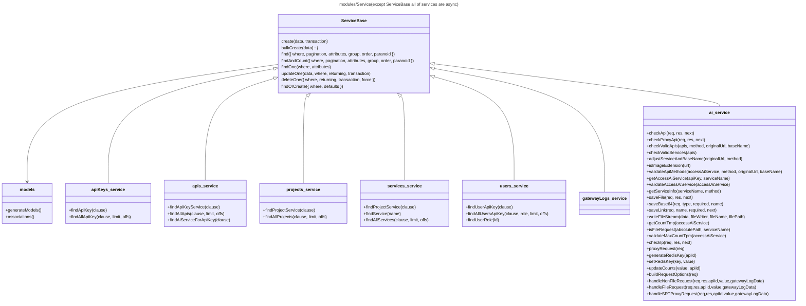

```mermaid
---
title: modules/Service(except ServiceBase all of services are async)
---
classDiagram
    ServiceBase --> models
    ServiceBase <|-- apiKeys_service
    ServiceBase <|-- apis_service
    ServiceBase <|-- projects_service
    ServiceBase <|-- services_service
    ServiceBase <|-- users_service
    ServiceBase <|-- gatewayLogs_service
    ServiceBase <|-- ai_service
    ServiceBase : create(data, transaction)
    ServiceBase : bulkCreate(data) {
    ServiceBase : find({ where, pagination, attributes, group, order, paranoid })
    ServiceBase : findAndCount({ where, pagination, attributes, group, order, paranoid })
    ServiceBase : findOne(where, attributes)
    ServiceBase : updateOne(data, where, returning, transaction)
    ServiceBase : deleteOne({ where, returning, transaction, force })
    ServiceBase : findOrCreate({ where, defaults })
    class models{
        +generateModels()
        +associations()
    }
    class apiKeys_service{
        +findApiKey(clause)
        +findAllApiKey(clause, limit, offs)
    }
    class gatewayLogs_service{
    }
    class apis_service{
        +findApiKeyService(clause)
        +findAllApis(clause, limit, offs)
        +findAiServiceForApiKey(clause)
    }
    class projects_service{
        +findProjectService(clause)
        +findAllProjects(clause, limit, offs)
    }
    class services_service{
       +findProjectService(clause)
       +findService(name)
       +findAllServices(clause, limit, offs) 
    }
    class users_service{
       +findUserApiKey(clause)
       +findAllUsersApiKey(clause, role, limit, offs)
       +findUserRole(id) 
    }
    class ai_service{
       +checkApi(req, res, next)
       +checkProxyApi(req, res, next)
       +checkValidApis(apis, method, originalUrl, baseName )
       +checkValidServices( apis )
       +adjustServiceAndBaseName(originalUrl, method)
       +isImageExtension(url)
       +validateApiMethods(accessAiService, method, originalUrl, baseName)
       +getAccessAiService(apiKey, serviceName)
       +validateAccessAiService(accessAiService)
       +getServiceInfo(serviceName, method)
       +saveFile(req, res, next)
       +saveBase64(req, type, required, name )
       +saveLink(req, name, required, next)
       +writeFileStream( data, fileWriter, fileName, filePath )
       +getCountTmp(accessAiService)
       +isFileRequest(absolutePath, serviceName)
       +validateMaxCountTpm(accessAiService)
       +checkIp(req, res, next)
       +proxyRequest(req)
       +generateRedisKey(apiId)
       +setRedisKey(key, value)
       +updateCounts(value, apiId)
       +buildRequestOptions(req)
       +handleNonFileRequest(req,res,apiId,value,gatewayLogData)
       +handleFileRequest(req,res,apiId,value,gatewayLogData) 
       +handleSRTProxyRequest(req,res,apiId,value,gatewayLogData)
    }
```