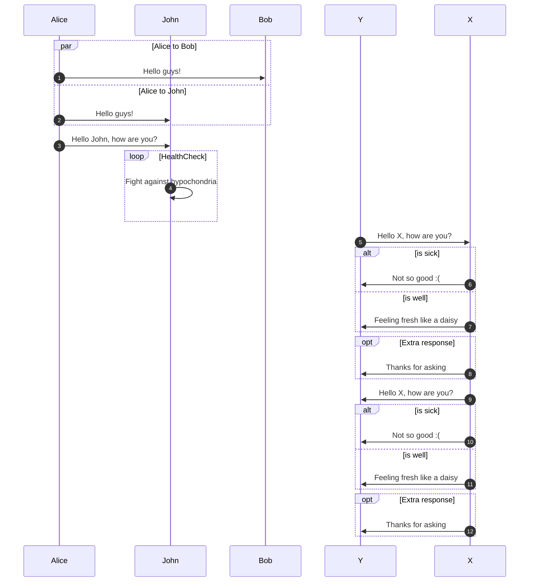

```mermaid
sequenceDiagram
    participant Alice
    participant John
    link Alice: Dashboard @ https://dashboard.contoso.com/alice
    link Alice: Wiki @ https://wiki.contoso.com/alice
    link John: Dashboard @ https://dashboard.contoso.com/john
    link John: Wiki @ https://wiki.contoso.com/john
    autonumber
    par Alice to Bob
        Alice->>Bob: Hello guys!
    and Alice to John
        Alice->>John: Hello guys!
    end
    Alice->>John: Hello John, how are you?
    loop HealthCheck
        John->>John: Fight against hypochondria
    end
    Y->>X: Hello X, how are you?
    alt is sick
        X->>Y: Not so good :(
    else is well
        X->>Y: Feeling fresh like a daisy
    end
    opt Extra response
        X->>Y: Thanks for asking
    end
    X->>Y: Hello X, how are you?
    alt is sick
        X->>Y: Not so good :(
    else is well
        X->>Y: Feeling fresh like a daisy
    end
    opt Extra response
        X->>Y: Thanks for asking
    end
```